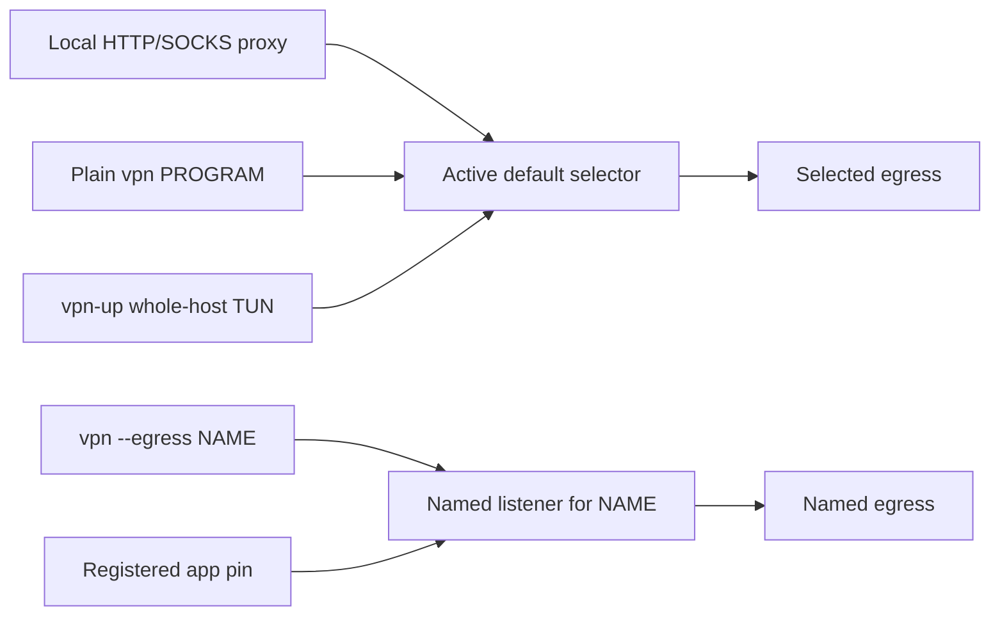

# VPN routes and controls

This is the operator guide for the installed VPN. An **egress** is a named
route, such as a WireGuard peer or VLESS outbound. The sing-box user service
loads this machine's assigned WireGuard peer and its shared routes at the same
time. Several applications can use different egresses concurrently.

## One outbound list

The encrypted inventory has one `outbounds` list. Each entry has a stable
`tag` and a protocol `type`; WireGuard and VLESS entries sit side by side.
That same tag is used in encrypted policy, `vpn-egress use NAME`,
`vpn --egress NAME`, and a named capture. There is one route-selection rule
for every entry.

The compiler places each entry in the section sing-box needs when it creates
the private runtime configuration. WireGuard becomes a sing-box endpoint;
VLESS remains a sing-box outbound. This is a detail of the generated file,
not another choice in the encrypted inventory or CLI. The source inventory is
therefore not a complete sing-box config; the compiler validates the generated
one with `sing-box check`.

## Traffic flow



The local proxy listens on `127.0.0.1:1080` (SOCKS5 and HTTP) and
`127.0.0.1:3128` (HTTP). Programs using their own proxy settings send only
proxy-aware traffic through it. `vpn PROGRAM` instead launches a program in a
network namespace that carries its TCP, UDP and DNS through the backend.
`vpn-up` explicitly routes public host traffic through a separate,
credential-free TUN; private and link-local routes remain on the physical
network. The backend holds provider credentials and binds its upstream traffic
to the physical interface. Capture and the host TUN do not start another
WireGuard client.

An explicit `--egress NAME` wins over an installed app's pin. An app pin wins
over the active default. Changing the default therefore moves the local proxy,
plain `vpn` launches and the host TUN, while named launches and pinned apps
keep their routes. The backend can serve all of those routes at once.

## Live commands

Run these as the ordinary desktop user:

| Command | Effect |
| --- | --- |
| `vpn-egress list` | Show this host's available route names, safe notes and default markers. |
| `vpn-egress status` | Show the active and declarative defaults and whether the active choice is temporary. |
| `vpn-egress use NAME` | Select a temporary default for unpinned traffic. |
| `vpn-egress default` | Restore the declarative default now. |
| `vpn-egress check NAME` | Probe one named route with a five-second HTTPS request. |
| `vpn-egress inspect NAME` | Read back a named capture's listener, namespace, scopes and attachment state. |
| `vpn PROGRAM [ARGS...]` | Run one program through the active default. |
| `vpn --egress NAME -- PROGRAM [ARGS...]` | Run one program through a named route. |
| `vpn-up` / `vpn-down` | Start or stop the whole-host TUN. These Zsh commands use `sudo` at runtime. |

For example:

```bash
vpn-egress list
vpn-egress status
vpn-egress use orange-vless
vpn -- curl https://example.com
vpn --egress orange-vless -- curl https://example.com
vpn-egress check orange-vless
vpn-egress default
```

Use a name shown by `vpn-egress list`; `orange-vless` is an example from the
deployed inventory. `vpn-egress check` establishes only that its HTTPS probe
worked at that moment. It does not test application DNS, UDP, or future
availability. An unknown name is rejected. A configured route that becomes
unreachable leaves its traffic blocked on that route rather than switching to
another egress or the physical network.

A temporary default lasts until `vpn-egress default`, a reboot, or the next
Home Manager switch. New unpinned connections use the selected route; existing
connections may stay on the previous route until they reconnect. Named
captures stay bound to their own egresses. `vpn-up` keeps following the active
default while the TUN is running. `vpn-down` restores
ordinary host routing and does not release VPNized apps from their captures.

## Configuration kept across switches

Two whole-file SOPS ciphertext documents hold VPN configuration:

| File | Owns |
| --- | --- |
| [`secrets/vpn/egresses.jsonc`](../secrets/vpn/egresses.jsonc) | One `outbounds` list of route definitions with stable `tag` names, plus a `dns.servers` entry detoured through each route. `//` comments are safe notes shown by `vpn-egress list`. |
| [`secrets/vpn/policy.jsonc`](../secrets/vpn/policy.jsonc) | Default route per hostname, exclusive WireGuard peer ownership, registered app pins, and each route's IPv6 capability. |

Edit a ciphertext document through `sops`, with the recovered age identity
available. Keep plaintext and credentials out of Git, Nix expressions, shell
arguments and logs:

```bash
sops secrets/vpn/policy.jsonc
sops secrets/vpn/egresses.jsonc
```

The policy has this shape. These names and hosts are illustrative; use the
inventory's exact tags and the machine's actual hostname:

```jsonc
{
  "defaults": {"host-a": "wg-a", "host-b": "wg-b"},
  "wireguard_owners": {"wg-a": "host-a", "wg-b": "host-b"},
  "pins": {
    "host-a": {"vesktop": "wg-a", "ayugram": "shared-vless"}
  },
  "ipv6": {"wg-a": false, "wg-b": false, "shared-vless": false}
}
```

| Desired persistent change | Edit |
| --- | --- |
| Change a host's normal default | Set `defaults[hostname]` to an available inventory tag. |
| Keep an installed app on a specific outbound | Set `pins[hostname][app-id]` to that outbound's tag. Remove the pin to make the app follow the active default. |
| Add a route | Add an entry with a stable `tag` to `outbounds`, plus a DNS server detoured through that tag. Add the tag to `ipv6`; if it is WireGuard, assign its hostname in `wireguard_owners`. |
| Change IPv6 for a named route | Set `ipv6[tag]` to `true` or `false`. Default traffic remains IPv4-only either way. |

After editing the encrypted files, an approved `home-manager switch --flake .#z`
applies them on the daily host. Use that machine's Home Manager output on
other hosts. This is a persistent change, unlike `vpn-egress use`.

The inventory contains every peer as encrypted source material, but a host's
running backend loads only its assigned WireGuard peer. A WireGuard peer must
not run on two machines at once. Shared non-WireGuard routes can be available
on both. Every route needs its own DNS server entry. All routes available to
one host currently need the same primary DNS server address. Server addresses
must be IP literals until physical-route hostname bootstrap is implemented.
The compiler rejects missing host defaults, unknown tags or pins, unowned
WireGuard peers, and invalid native sing-box entries.

Home Manager activation validates incoming encrypted configuration before
replacing the live bindings. It resets the active default to that hostname's
declarative default. If a pin changes, its installed app scope is stopped; if
a named route is removed or its definition or IPv6 policy changes, all scopes
on that route are stopped, including one-off `vpn` launches. Relaunch those
programs after the switch. Ordinary backend restarts leave compatible
captures attached, with traffic blocked until the backend returns.

## Manage VPNized applications step by step

Home Manager defines **which applications are VPNized**. Each enabled app
module installs its VPN launcher and contributes one ID to
`dotfiles.vpnizedApps.registered`. Home Manager generates the registry from
those contributions; do not edit the generated list. The encrypted policy
defines **which outbound an app uses** through `pins[hostname][app-id]`. An
app with no pin still uses the VPN, through the active default.

The current [home.nix](../home.nix) enables the two installed VPNized apps:

```nix
dotfiles.vpnizedApps.vesktop.enable = true;
dotfiles.vpnizedApps.ayugram.enable = true;
```

When the steps below say to build and switch, use these commands from the
repository root. The build does not activate anything; the switch changes the
running user environment and should be done only when ready:

```bash
nix build --no-link .#homeConfigurations.z.activationPackage
home-manager switch --flake .#z
```

### Change an existing app's outbound

1. Run `hostname` to get this machine's policy key, and `vpn-egress list` to
   find an available outbound tag. The tag must match an entry in the
   inventory's `outbounds` list.
2. Open the encrypted policy with `sops secrets/vpn/policy.jsonc`. Under this
   hostname's `pins`, set the app ID to that tag. For example, this pins
   Vesktop to `shared-vless` while AyuGram follows the active default:

   ```jsonc
   "pins": {
     "host-a": {"vesktop": "shared-vless"}
   }
   ```

   `host-a` and `shared-vless` are illustrative. Keep the other policy fields
   and host entries. To unpin Vesktop, delete its `"vesktop": ...` entry;
   leave an empty object for the host if it has no other pins. JSONC permits
   `//` comments, but no trailing commas.
3. Build the Home Manager generation, then switch it when ready. The switch
   validates the policy before replacing live routes and stops a running app
   scope if its pin changed. Relaunch that app to use its new outbound. For a
   temporary one-time override instead, use the app launcher's `--egress NAME`
   option; it takes precedence over the pin.

### Add another VPNized app

1. Add an app module under `modules/programs/` with its own
   `dotfiles.vpnizedApps.APP.enable` option. Install a launcher that passes the
   stable, lowercase app ID to the shared command. The core launcher call is:

   ```bash
   exec "$VPN_COMMAND" --app newapp -- "$VPN_NEWAPP" "$@"
   ```

   `VPN_NEWAPP` must point to the package's real executable, not back to the
   launcher. The launcher also needs to handle that program's arguments and
   already-running instance behavior.
2. Make every ordinary launch path reach the launcher: terminal command,
   desktop entry, URL handler, and D-Bus activation where the package uses
   them. [AyuGram's module](../modules/programs/ayugram.nix) replaces its
   command, desktop entry, and D-Bus service;
   [Vesktop's module](../modules/programs/vesktop.nix) replaces its command and
   desktop entry. For an Electron or Chromium app on Ubuntu, add the needed
   exact-path AppArmor user namespace allowance too.
3. In the module's enabled branch, register the same ID used by the launcher
   and install the wrapped package. For example, Vesktop currently does:

   ```nix
   options.dotfiles.vpnizedApps.vesktop.enable =
     lib.mkEnableOption "Vesktop, always launched through the VPN";

   # Inside the branch enabled by that option:
   dotfiles.vpnizedApps.registered = [ "vesktop" ];
   home.packages = [ vesktop ];
   ```

   IDs use lowercase letters, digits, and hyphens, starting with a letter.
   Each enabled module must register a distinct ID. The ID in the policy and
   `vpn --app` must match it exactly.
4. Import the module in [home.nix](../home.nix), then enable its option there.
   Build the Home Manager generation. Add `pins[hostname].newapp` in the
   encrypted policy only if the app should use a fixed outbound; without a pin
   it follows the active default. Switch the generation when ready and launch
   the app through its normal command or icon.

The compiler validates this host's policy pins against the generated registry.
The runtime resolver and scope reconciliation use that same registry, so adding
an app ID does not require changing their allowlists. A policy entry alone
cannot make an ordinary application launch through the VPN. For an occasional
program, use `vpn --egress NAME -- PROGRAM` without registering it.

### Disable or remove an app

1. Delete its pin from this host's encrypted policy. A pin for a disabled app
   makes policy validation fail.
2. Set its `dotfiles.vpnizedApps.APP.enable` option to `false` or remove the
   enable line from `home.nix`. The module then stops installing its VPN
   launcher and stops contributing its ID to the registry. If the application
   should remain installed without the VPN launcher, declare that separately.
3. Build and switch the Home Manager generation. Reconciliation stops any
   running scope for an app removed from the registry. Remove the module and
   its `home.nix` import only when nothing else uses them.

## Installed apps and limits

Vesktop and AyuGram are the two installed VPNized apps. AyuGram replaces the
official Telegram desktop client here; there is no separately installed
Telegram app or `telegram` policy key. `home.nix` enables AyuGram's VPN
launcher, which covers its terminal command, desktop entry and `tg://` links.
The encrypted policy's `pins[hostname].ayugram` assigns it a fixed named
route. Without that pin, the launcher still uses the VPN through the active
default. Vesktop follows the same pattern for `discord://` links.

For a one-time override, run `vesktop --egress NAME --` or
`AyuGram --egress NAME --`; quit an already-running copy first if it is on
another route. An unpinned app uses the active default. Other ordinary
executables can be launched with `vpn --egress NAME -- PROGRAM`, but their
desktop entries are not automatically rewritten.

`vpn` rejects Snap and Flatpak executables. Electron and Chromium apps other
than the managed Vesktop are not supported by capture yet; on Ubuntu they
also need an exact-path AppArmor user namespace allowance. The default proxy,
plain `vpn` and host TUN are IPv4-only. A named capture uses the IPv6 setting
in encrypted policy. Route selection is manual; automatic failover is not
configured.

For design decisions and observed staging and host behavior, see
[DECISIONS.md](DECISIONS.md#scripts-and-privileged-networking) and
[STAGING.md](STAGING.md).
